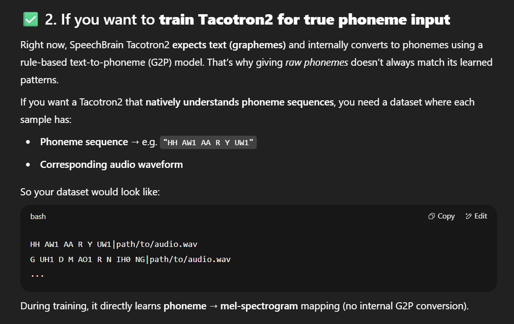
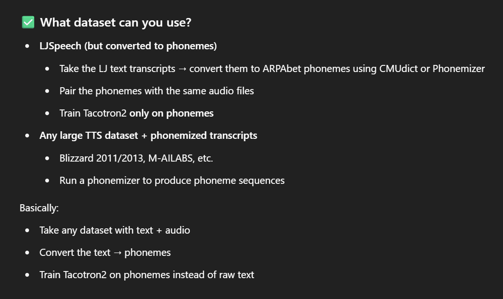
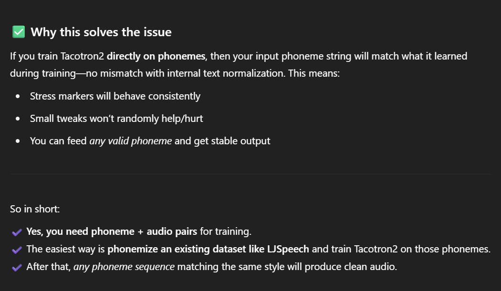

# Date: 15-07-2025

## ✅ Today's Work

- Tested a different library, **SpeechBrain**, because the models in the previous library (**Coqui TTS**) weren’t trained to handle **phoneme input properly**.  
- Tested two different models from the SpeechBrain library: **FastSpeech2** and **Tacotron2**.  
- We were able to produce output audio in both cases.  
- However, the **output produced by the FastSpeech2 model was much clearer and more natural** compared to the Tacotron2 model.

---

## 📌 Findings

1. **FastSpeech2 handled phoneme input correctly**  
   - FastSpeech2 was able to produce intelligible audio when **phonemes were given as input**, because it has a function called `encode_phoneme()`, which allows phoneme input.  
   - Tacotron2 does **not** have this feature and only provides `encode_text()`, which accepts **text input only**, not phonemes.  

2. **Speed difference between models**  
   - FastSpeech2 generated the output audio **faster** than Tacotron2.  
   - Reason: **FastSpeech2 is a non-autoregressive model**, while Tacotron2 is an **autoregressive model**.  
   - Non-autoregressive models generate the entire output in **parallel**, whereas autoregressive models generate audio **step-by-step**, making them slower.  

3. **Audio duration**  
   - The duration of audio produced by FastSpeech2 was **0:0 seconds** (very short and efficient).  
   - For Tacotron2, the audio took **more time to produce**.  
   - This shows that **FastSpeech2 is more efficient and faster** than Tacotron2.  

4. **FastSpeech2 drawback: need for an aligner during training**  
   - FastSpeech2 uses an **aligner** to match the duration of phonemes/text with the timing of the audio.  
   - Since we used a **pre-trained model**, it was already aligned by the original trainers, so **no extra aligner was needed** for inference.  
   - But if we want to **train FastSpeech2 from scratch**, we would need an **external aligner** to properly align phoneme sequences with audio frames.  

---

## 📝 Notes  

### 🔄 Autoregressive vs Non-Autoregressive Models  

- **Autoregressive Models (Tacotron2)**  
  - Generate audio **step-by-step**, where each output frame depends on the previous one.  
  - **Pros:** Usually produce **better naturalness** and prosody.  
  - **Cons:** **Slower** because it has to wait for the previous frame before generating the next.  

- **Non-Autoregressive Models (FastSpeech2)**  
  - Generate the entire audio **in parallel**, without depending on previous frames.  
  - **Pros:** Much **faster** and more efficient for inference.  
  - **Cons:** May need extra processing like **duration prediction** or an aligner to maintain accuracy.  

---

### ⏱️ What is an Aligner in FastSpeech2?  

- An **aligner** is a tool or process that **matches phonemes (or text tokens)** to their corresponding **time durations in the audio**.  
- FastSpeech2 doesn’t learn this alignment on its own.  
- When training from scratch:  
  - You need an **external aligner** (like **MFA - Montreal Forced Aligner**) to tell the model **how long each phoneme should last**.  
- For pre-trained models, this alignment is already done during training, so you don’t need to worry about it during inference.  

---

### 🔤 `encode_phoneme()` vs `encode_text()`  

- **`encode_text()`**  
  - Converts **normal text** into the internal representation (like phoneme IDs or embeddings) that the model understands.  
  - Example: `"Hello"` → [h, e, l, o] → model embeddings.  
  - Used in models like **Tacotron2**, which expect only **text input**.  

- **`encode_phoneme()`**  
  - Takes **phoneme sequences** (like ARPAbet) directly as input, bypassing text-to-phoneme conversion.  
  - Example: `HH AH0 L OW1` → model embeddings.  
  - Used in models like **FastSpeech2**, which can accept **direct phoneme input** for more control over pronunciation.  

---

✅ **Summary:**  
- **FastSpeech2** is faster, more efficient, and supports **phoneme input** directly with `encode_phoneme()`.  
- **Tacotron2** only accepts **text input** and is slower because it is **autoregressive**.  
- **FastSpeech2** needs an **aligner** if trained from scratch, but not for pre-trained models.  

---

## 🔗 Important Links  

- [Reference Link](https://copilot.microsoft.com/shares/ct7isoTGuyC8QmVh41Fb2)
- [Reference Link](https://chatgpt.com/s/t_687668c701208191b767d9ea1a96069f)

---

## 💬 ChatGPT Discussion: Training Tacotron2 for True Phoneme Input  

Below are key parts of the ChatGPT discussion, shown as images for clarity.  

---

### ✅ 1. Why Tacotron2 doesn’t natively handle phonemes  



---

### ✅ 2. What dataset you can use for phoneme-based training  



---

### ✅ 3. Why this solves the issue  



---


## ▶️ Example Script to Run Tacotron Model from SpeechBrain  

```python
import torch
import torchaudio
from speechbrain.inference import Tacotron2, HIFIGAN
from IPython.display import Audio
import soundfile as sf

# Load models
print("Loading models...")
tacotron2 = Tacotron2.from_hparams(source="speechbrain/tts-tacotron2-ljspeech")
hifi_gan = HIFIGAN.from_hparams(source="speechbrain/tts-hifigan-ljspeech")

# Phoneme input for "How are you"
phonemes = "HH1 AW AA R Y UW1"
print(f"Converting phonemes: {phonemes}")

# Generate audio
mel_output, mel_lengths, alignments = tacotron2.encode_text(phonemes)
waveform = hifi_gan.decode_batch(mel_output)

# Save and play audio
output_path = "phoneme_output.wav"
sf.write(output_path, waveform.squeeze().cpu().numpy(), 22050)

print("Audio generated! Playing...")
Audio(output_path)
```
## ▶️ Example Script to Run FastSpeech2 Model from SpeechBrain

```python
import torch
from speechbrain.inference.TTS import FastSpeech2
from speechbrain.inference.vocoders import HIFIGAN
from IPython.display import Audio
import torchaudio

# Load FastSpeech2 model
print("Loading FastSpeech2 model...")
fastspeech2 = FastSpeech2.from_hparams(source="speechbrain/tts-fastspeech2-ljspeech")

print("Loading HiFiGAN vocoder...")
hifi_gan = HIFIGAN.from_hparams(source="speechbrain/tts-hifigan-ljspeech")

# Phoneme input for "How are you" - using SpeechBrain's phoneme format
input_phonemes = ['HH', 'AW', 'AA', 'R', 'Y', 'UW']
print(f"Converting phonemes: {input_phonemes}")

# Generate mel-spectrogram from phonemes using FastSpeech2
mel_output, durations, pitch, energy = fastspeech2.encode_phoneme(
    [input_phonemes],
    pace=1.0,          # adjust speed
    pitch_rate=1.0,    # adjust pitch
    energy_rate=1.0,   # adjust energy
)

# Generate waveform from mel-spectrogram using HiFiGAN
waveform = hifi_gan.decode_batch(mel_output)

# Save and play audio
output_path = "fastspeech2_phoneme_output.wav"
torchaudio.save(output_path, waveform.squeeze(1), 22050)

print("Audio generated with FastSpeech2 using direct phoneme input! Playing...")
Audio(output_path)
```

